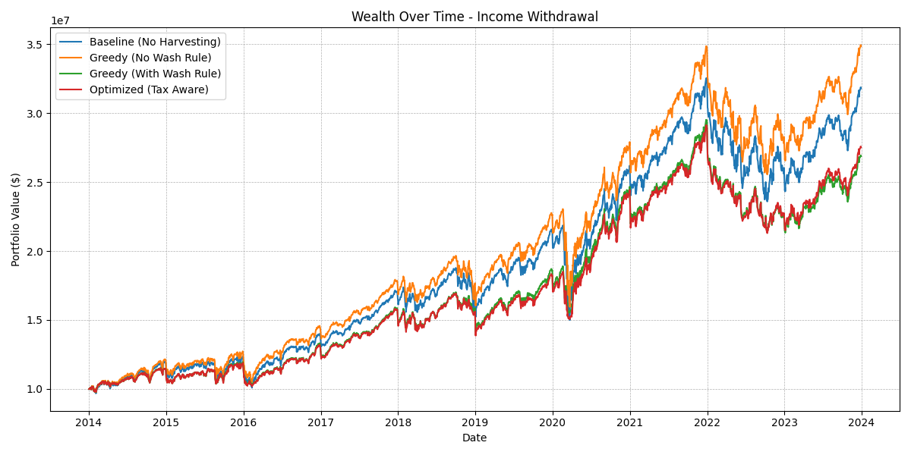

# Tax-Loss Harvesting Backtesting Engine

This project simulates and evaluates the performance of Tax-Loss Harvesting (TLH) strategies on a Direct Indexing portfolio tracking the S&P 500 (Top 50 constituents) over the last decade (2014-2024).

The core goal is to quantify the "Tax Alpha" generated by actively harvesting losses versus a simple Buy & Hold baseline, while accounting for Wash Sale rules and different cash flow needs.

## Key Findings (2014-2024)

1.  **"No Wash" Strategy Wins**: The theoretical best performer was the **Greedy (No Wash)** strategy ($32.6M vs $29.8M Baseline). By ignoring the 30-day lockout period, it captured tax credits without missing out on market rebounds ("Cash Drag").
2.  **Cash Drag Hurts**: Strategies that strictly obeyed wash sale rules (Greedy With Wash, Optimized) **underperformed** the simple Buy & Hold baseline ($25.6M vs $29.8M). In a strong bull market like 2014-2024, the opportunity cost of sitting in cash for 30 days outweighed the tax benefits of harvesting.
3.  **Charity is Powerful**: The "Charitable Giving" scenario (annual contribution + terminal donation) resulted in the highest final wealth ($83.3M) because it avoids the massive liquidation tax at the end of the investment horizon.



## Methodology

*   **Universe**: Top 50 S&P 500 stocks.
*   **Period**: Jan 1, 2014 - Jan 1, 2024.
*   **Initial Capital**: $10,000,000.
*   **Tax Rate**: Flat 20%.
*   **Reinvestment**: Realized losses generate an immediate tax credit (`Loss * 0.20`) which is reinvested into the portfolio.

### Strategies Tested
1.  **Baseline**: Buy & Hold (Monthly Rebalancing). No harvesting.
2.  **Greedy (No Wash)**: Sells losers and immediately buys them back. Captures tax alpha but violates wash sale rules.
3.  **Greedy (With Wash)**: Sells losers and holds cash for 30 days before buying back. Compliant but suffers from cash drag.
4.  **Optimized**: Uses convex optimization (`cvxpy`) to track the index while avoiding restricted stocks.

## Results Summary

**Scenario 1: Income Withdrawal** (Withdraw 5%/year, Pay Tax at End)
| Strategy | Final Wealth | Taxes Paid | Realized Losses |
| :--- | :--- | :--- | :--- |
| **Baseline** | $29.8M | $2.8M | $1.8M |
| **Greedy (No Wash)** | **$32.6M** | $2.7M | $6.4M |
| **Greedy (With Wash)** | $25.6M | $4.4M | $22.6M |
| **Optimized** | $25.7M | $4.4M | $22.5M |

**Scenario 2: Charitable Giving** (Contribute $1M/year, Donate at End)
| Strategy | Final Wealth | Taxes Paid | Realized Losses |
| :--- | :--- | :--- | :--- |
| **Baseline** | $76.0M | $3.5M | $3.4M |
| **Greedy (No Wash)** | **$83.3M** | $2.9M | $13.7M |
| **Greedy (With Wash)** | $65.6M | $7.5M | $43.9M |
| **Optimized** | $67.3M | $7.8M | $44.7M |

## How to Run

1.  Install dependencies:
    ```bash
    pip install -r requirements.txt
    ```
2.  Run the simulation:
    ```bash
    python main.py
    ```
    This will download the latest data, run all 8 simulations, and generate the plots and CSV results found in this repo.

